# Hi, I'm Raiden
I'm an Information Management student interested in AI, Machine Learning, Web Development, and Database Systems.

## About Me
- Information Management student
- Interested in AI, Machine Learning, Deep learning and Cybersecurity applications
- Python, React, PostgreSQL, Docker

## Featured Projects

### Wi-Fi Sensing / CSI Research Practice
A research-oriented project exploring Wi-Fi sensing using CSI and BFI-related data.

- Worked with Raspberry Pi, Nexmon CSI, UDP traffic, and packet capture
- Studied CSI/BFI extraction, preprocessing, and activity sensing workflows

## GitHub Stats

